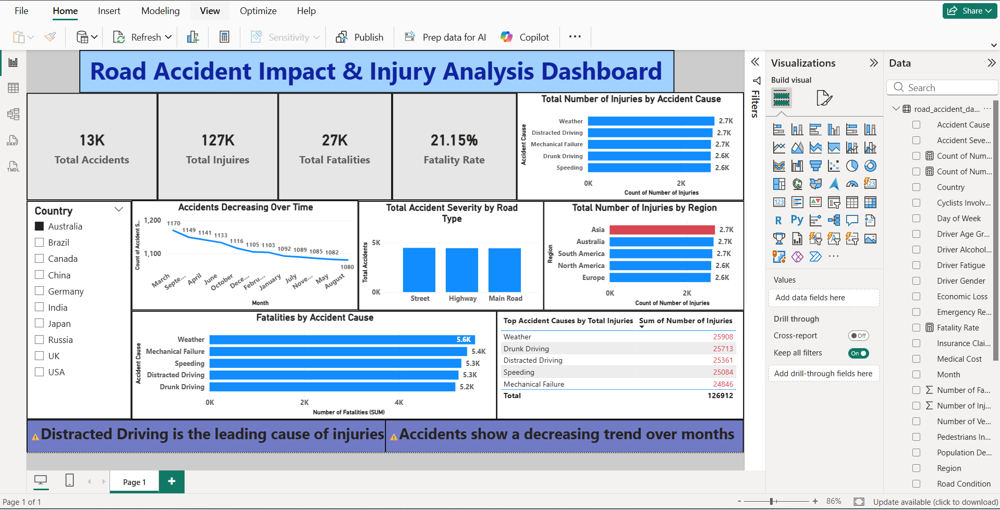

# 🚦 Road Accident Impact & Injury Analysis Dashboard

## 📌 Project Overview
This project presents an interactive Power BI dashboard designed to analyze road accident data and uncover key insights related to accident frequency, injuries, fatalities, and contributing factors.

The dashboard enables users to explore trends, identify high-risk causes, and understand regional impacts to support data-driven decision-making.

> 🚀 Built as a portfolio project to demonstrate data analysis, dashboard design, and business insight generation skills using Power BI.

---

## 🎯 Objectives
- Analyze total accidents, injuries, and fatalities  
- Identify major causes of road accidents  
- Evaluate regional distribution of accident impact  
- Track trends over time  
- Calculate key performance metrics like fatality rate  

---

## 📊 Key Insights
- ⚠️ **Distracted Driving** is the leading cause of injuries and fatalities  
- 📉 Accidents show a **decreasing trend over time**  
- 🌍 **Asia** has the highest number of injuries  
- 💀 Fatality rate is approximately **21%**  

---

## 📷 Dashboard Preview


---

## 🛠 Tools & Technologies Used
- **Power BI** – Data visualization and dashboard creation  
- **DAX (Data Analysis Expressions)** – KPI calculations and measures  
- **Power Query** – Data cleaning and transformation  

---

## 📈 Key Metrics (KPIs)
- Total Accidents  
- Total Injuries  
- Total Fatalities  
- Fatality Rate  

---

## 📂 Project Structure
```
Road-Accident-Impact-Injury-Analysis/
│
├── Dashboard.pbix
├── dataset.csv
├── dashboard_screenshot.png
├── README.md
```


---

## 📂 Dataset
Due to file size limitations, the dataset is not included in this repository.

You can access the dataset here:
https://drive.google.com/file/d/1mLRnaNH4QxMYbBEYVOTt1Xzgl1UPAHnV/view

## 🚀 How to Use
1. Download the `.pbix` file  
2. Open it using Power BI Desktop  
3. Explore filters and visuals  

---

## 💡 Business Impact
This dashboard helps:
- Identify high-risk driving behaviors  
- Improve road safety strategies  
- Support data-driven decision-making  
- Highlight regions requiring attention  

---

## 🧠 Skills Demonstrated
- Data Cleaning & Transformation  
- Data Modeling  
- DAX Calculations  
- Data Visualization & Storytelling  
- Analytical Thinking  

---

## 👨‍💻 Author
**Patri Chaitanya Sri Lalitha Sai**  

📧 Email: chaitanyapatri749@gmail.com  
🔗 LinkedIn: https://www.linkedin.com/in/patri-chaitanya-sri-lalitha-sai-2a53bb278/  
💻 GitHub: https://github.com/patri-chaitanya  

---

## ⭐ If you found this project useful, feel free to star the repository!
